 

  

 

  <b>`//Software · Apps · Webs`</b>
  <samp>
       
      ¡Hola! Este es <b>MIXUS</b>, mi estudio de software
  </samp>

  

 

  

 
 

 
  
  
  
  
  
  
  
  
  
  
  
  

 
 

  
  

  

 
 

  

      <samp>
        <b>Más info</b>
      </samp>
  

 

##

 

  <samp>
    <b>
      Contacto:
    </b>
  </samp>
   
   

  
  
  

  

      <samp>
        // <a href="https://mixus.pro/productos/ecorutine">EcoRutine</a> ⊹
        <a href="https://mixus.pro/productos/kyron">Kyron</a> ⊹
        <a href="https://mixus.pro/productos/diagramix">Diagramix</a> ⊹
        <a href="https://mixus.pro/productos/pos-system">Pos-System</a> //
      </samp>
  

 

##

 

  

 

