  
  
  

## `// Quién soy`

Soy **Elías**, técnico informático, desarrollador y QA tester. **MIXUS** es mi estudio de
software: IA, automatización, aplicaciones y soluciones digitales a medida, con ingeniería
y diseño cuidados hasta el último detalle.

- ✓ **Calidad testeada** — cada entrega pasa por QA formal antes de llegar a tus manos.
- ✓ **Código propio** — nada de plantillas recicladas; cada proyecto se construye a medida.
- ✓ **Trato directo** — hablas con quien desarrolla, sin intermediarios.
- ✓ **Entrega documentada** — código, accesos y documentación: todo queda en tus manos.

## `// Productos`

| Producto | Descripción | |
|---|---|---|
| **EcoRutine** | Finanzas personales 100 % offline para Android | [`VER FICHA →`](https://mixus.pro/productos/ecorutine) |
| **Kyron** | Asistente de IA de escritorio con HUD futurista | [`VER FICHA →`](https://mixus.pro/productos/kyron) |
| **Diagramix** | Editor de diagramas profesional en el navegador | [`VER FICHA →`](https://mixus.pro/productos/diagramix) |
| **Pos-System** | Punto de venta para comercios: caja, stock y reportes | [`VER FICHA →`](https://mixus.pro/productos/pos-system) |

> Demos interactivas y capturas reales en [mixus.pro](https://mixus.pro) · Los repositorios son privados: si quieres ver código o una demo en vivo, [escríbeme](https://mixus.pro/contacto).

## `// Tecnologías`

  
  
  
  
  
  
  
  
  
  
  

**QA y automatización:** diseño de casos de prueba, ejecución y reporte, suites automatizadas
sobre aplicaciones reales con Playwright.

## `// Contacto`

  

`RESPUESTA < 24 HS · CONSULTA SIN CARGO · LUN–SÁB 9:00–19:00 ART`
